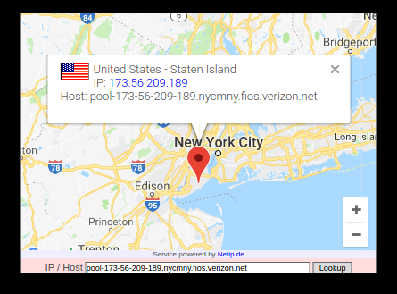

## MMM-URHere

Displays map with your location, IP Address, Internet Provider and National Flag

## Examples

## Installation

* `git clone https://github.com/mykle1/MMM-URHere` into the `~/MagicMirror/modules` directory.

## Config.js entry and options

    {
           disabled: false,
           module: 'MMM-URHere',
           position: 'top_center',
    },
